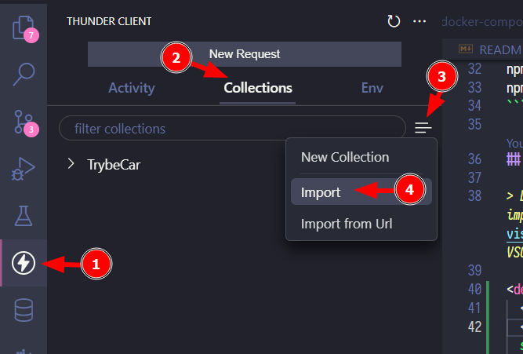

# TrybeCar API

Uma API para gerenciamento de corridas, pessoas motoristas e passageiras.

Essa API é usada como exemplo didático para o bloco de Arquitetura de Software do Curso de Desenvolvimento Web da Trybe.

<details>
  <summary>Branchs no repositório</summary>

  1. `complex-application` - início do bloco
  2. `simple-application-model-course` - conteúdo do dia de model completo
  3. `simple-application-model-live-lectures` - aula ao vivo do dia de model completo
  4. `simple-application-service-course` - conteúdo do dia de service completo
  5. `simple-application-service-live-lectures` - aula ao vivo do dia de service completo
  6. `simple-application-controller-course` - conteúdo do dia de controller completo
  7. `simple-application-controller-live-lectures` - aula ao vivo do dia de controller completo
</details>

## Rodando a aplicação inicial via Docker

- Clone o repositório e acesse a branch `complex-application` do projeto

```bash
git clone git@github.com:tryber/msc-architecture-trybecar.git
cd msc-architecture-trybecar
git checkout complex-application
```

- Inicie os contêineres via Docker Compose
  
```bash
docker-compose up -d
```

- Conecte no banco de dados MySQL do contêiner `trybecar_db` exposto na porta `33060` usando algum cliente SQL (como o [MySQL Workbench](https://dev.mysql.com/downloads/workbench/) ou a extensão [MySQL](https://marketplace.visualstudio.com/items?itemName=cweijan.vscode-mysql-client2) para o VSCode)
  - Utilize o usuário `root` e a senha `root`
  - Execute o script `script.sql` para criar as tabelas e alguns dados iniciais.
  - Você pode usar esse script a qualquer momento para recriar as tabelas se necessário.

- Acesse o `bash` dentro do contêiner Node `trybecar`, instale as dependências e inicie o servidor

```bash
docker exec -it trybecar bash
npm install
npm run debug
```

## Lista de endpoints

> Dica: Há uma coleção dos endpoints em formato JSON para importação na extensão [Thunder Client](https://marketplace.visualstudio.com/items?itemName=rangav.vscode-thunder-client) do VSCode no arquivo `thunder-trybecar.json`

<details>
  <summary>Como importar a coleção no Thunder Client</summary>

  1. Abra a aba da extensão Thunder Client
  2. CLique na aba Collections
  3. Clique no menu de opções
  4. Clique em Import
  5. Escolha o arquivo `thunder-trybecar.json`
  6. Clique em OK
  
  
</details>

- A serem refatorados
  - POST `/passengers/:passengerId/request/travel`
  - GET `/drivers/open/travels`
  - PUT `/drivers/:driverId/travels/:travelId/assign`
  - PUT `/drivers/:driverId/travels/:travelId/start`
  - PUT `/drivers/:driverId/travels/:travelId/end`
- A serem implementados nos exercícios
  - GET `/drivers`
  - POST `/drivers`
  - POST `/cars`

Os endpoints são apresentados com mais detalhes no conteúdo e exercícios.
